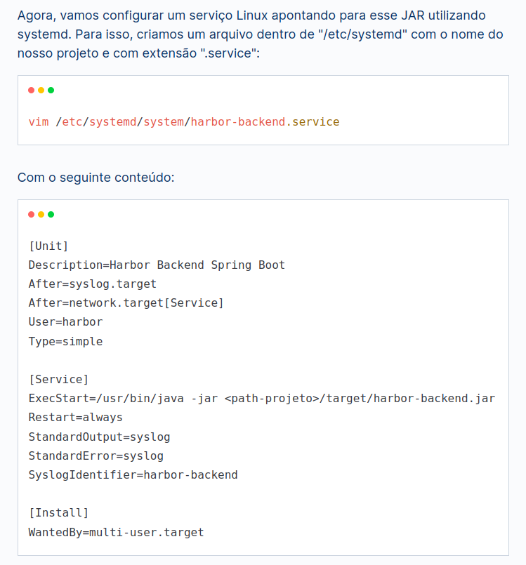

# API de serviço do Sistema AGBSim

## Passos para deploy da aplicação pela Primeira vez:

tutorial de referência no no link: https://www.alura.com.br/artigos/publicando-springboot-e-frontend-em-producao?gclid=Cj0KCQjwnrmlBhDHARIsADJ5b_nT4Ek0sFuQz6xS2S1bFfbNTZuA2NKmqmxiLYQa8jl8QGbv_u8vkt8aAuA3EALw_wcB

* fazer a clonagem do código no repositório no Github (ou git pull caso tenha já clonado o prjeto)
* Criar as pasta /files_simulation na raiz do sistema e dar permissão de escrita e leitura total (será utilizadas para resultados e repositórios de arquivos necessários no sistema)
* executar a compilação do projeto spring-boot com o comando mvn clean package (necessário instalação do maven caso não tenho instalado no servidor)
* após o passo anterior, criar serviço no sistema com os passos descritos abaixo: 
 

## Passos para deploy da aplicação em fase de atualização:

* fazer a parada do serviço com o comando sudo systemctl stop nome_do_serviço criado no passo inicial
* fazer a execução do comando git pull
* executar o build do projeto com o comando mvn clean package
* fazer a inicialização do serviço com o comando sudo systemctl start nome_do_serviço criado no passo inicial

  ## Passos para atualização de certificado (cada três meses):

* Executar: openssl pkcs12 -export -in /etc/letsencrypt/live/pixel.procc.fiocruz.br/fullchain.pem -inkey /etc/letsencrypt/live/pixel.procc.fiocruz.br/privkey.pem -out keystore.p12 -name "agbsim_api"
* password "agbsim_api"
* copiar keystore.p12 para o diretório /sistemas/AGBSim/src/main/resources
* fazer a inicialização do serviço com o comando sudo systemctl restart nome_do_serviço (agbsim.service no caso do pixel) criado no passo inicial
